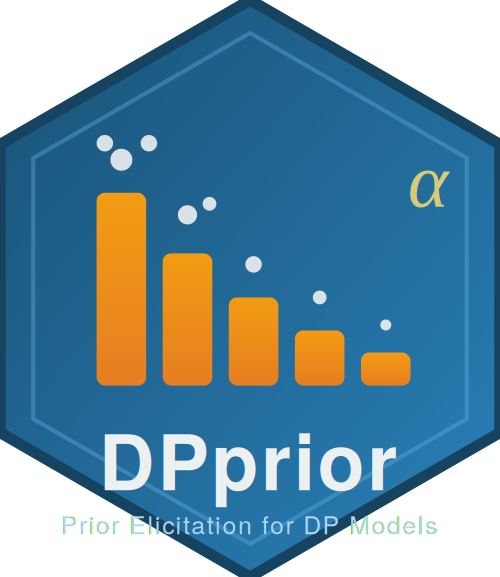

# DPprior 

<!-- badges: start -->
[](https://opensource.org/licenses/MIT)
<!-- badges: end -->

**Decision-ready prior elicitation for Dirichlet Process mixture models**

DPprior translates beliefs about occupied-cluster counts and cluster-weight
behavior into Gamma shape-rate priors for the Dirichlet Process concentration
parameter. Version 2 returns a canonical, auditable object contract: numerical
results, verification, provenance, optimizer attempts, and compatibility views
are kept separate.

## Installation

```r
# install.packages("devtools")
devtools::install_github("joonho112/DPprior")
```

## Current workflow

Construct a reusable cluster-count target, then fit it with the exact A2-MN
producer:

```r
library(DPprior)

target_K <- DPprior_target_K(
  J = 50,
  mu_K = 5,
  var_K = 8
)

fit <- DPprior_fit(
  J = 50,
  target_K = target_K,
  method = "A2-MN",
  check_diagnostics = FALSE
)

fit$parameters                 # Gamma shape a and rate b
fit[c("status", "usable", "verified")]
fit$target$K$implied[c("mean", "variance")]
fit$achieved$K[c("mean", "variance")]

print(fit)
summary(fit)
plot(fit)
```

For a simpler request, `DPprior_fit()` can construct the target directly:

```r
fit_simple <- DPprior_fit(
  J = 50,
  mu_K = 5,
  confidence = "medium"
)
```

Supported uncertainty routes are direct variance, qualitative confidence,
coefficient of variation, an interval target, or a strict target PMF. Supply
exactly one route.

## Canonical results

Current producers return `dpprior.result/1` objects with a common scientific
spine:

- `status`, `usable`, and `verified` state what the result supports;
- `parameters`, `target`, `achieved`, and `residuals` state the claim;
- `computation` records controls, attempts, selection, and termination;
- `verification` records independent checks;
- `provenance` records the method and source lineage;
- `compatibility` contains non-authoritative migration views.

Use the canonical nested fields in new code. Flat aliases such as `a` and `b`
may exist for compatibility, but they are not the scientific contract. A result
is decision-ready only when its mode-specific contract and its public status
fields permit that use; optimizer exit alone is not verification.

When calibration cannot return an approved result, DPprior signals a typed
condition and retains the canonical evidence in `condition$result`:

```r
out <- tryCatch(
  DPprior_fit(J = 50, mu_K = 5, var_K = 8),
  dpprior_calibration_error = function(condition) condition$result
)
```

## Dual-anchor calibration

Start dual-anchor calibration from a verified, usable K-only fit.

### Hard inequality

Use `DPprior_dual_hard()` when the scientific requirement is an inequality.
It minimizes the fixed-scale K loss subject to a named weight constraint and
independently verifies satisfaction.

```r
hard <- DPprior_dual_hard(
  fit,
  constraint = list(
    metric = "wsb_tail",
    threshold = 0.5,
    relation = "<=",
    bound = 0.45
  )
)

hard[c("status", "usable", "verified")]
hard$constraint[c("satisfied", "residual")]
```

The certified `wmax_tail_upper` route is available only for upper/at-most
safety constraints. Direct W-max probability calibration remains deferred.

### Soft trade-off

Use `DPprior_dual_soft()` when the scientific question is an explicit
fixed-scale trade-off. Lambda is a trade-off weight, not a hard-satisfaction
probability.

```r
soft <- DPprior_dual_soft(
  fit,
  target = list(
    metric = "wsb_tail",
    threshold = 0.5,
    relation = "target",
    value = 0.30
  ),
  lambda = 0.5
)

soft[c("status", "usable", "verified")]
soft$tradeoff[c("lambda", "K_loss", "weight_loss", "total_loss")]
```

Hard and soft results retain the authoritative K-only input lineage used by
their comparison plots.

### Retained historical adapter

`DPprior_dual()` reproduces the historical equality-loss workflow. It remains
available throughout v2.x, will not be removed before v3.0, and requires a
migration review before any removal. It emits one lifecycle warning and always
returns a legacy, approximate, unverified result. It is not a hard-constraint
certificate; use `DPprior_dual_hard()` or `DPprior_dual_soft()` for new work.

## Algorithms

- **A1**: closed-form shifted-Negative-Binomial proxy. It is fast and explicitly
  approximate; proxy round-trip identity is not finite-design verification.
- **A2-MN**: finite-design moment matching with independent higher-order
  verification.
- **A2-KL**: KL minimization for a complete target distribution, with separate
  adequacy and order-stability checks.

## Migration from 1.1

`upgrade_DPprior_object()` validates current objects and conservatively upgrades
exactly recognized 1.1 fits or diagnostics. Migration never turns incomplete
legacy evidence into a verified current calibration. Refit with the current API
when a decision-ready result is required.

## Documentation

- [Introduction](https://joonho112.github.io/DPprior/articles/introduction.html)
- [Quick Start](https://joonho112.github.io/DPprior/articles/quick-start.html)
- [Function reference](https://joonho112.github.io/DPprior/reference/index.html)
- [Package site](https://joonho112.github.io/DPprior/)

## Citation

If you use DPprior, please cite the package and the methodological work:

```bibtex
@Manual{DPprior2026,
  title = {{DPprior}: Principled Prior Elicitation for {Dirichlet} Process Mixture Models},
  author = {JoonHo Lee},
  email = {jlee296@ua.edu},
  year = {2026},
  note = {R package version 2.0.0},
  url = {https://github.com/joonho112/DPprior}
}

@Article{Lee2025multisite,
  title = {Improving the Estimation of Site-Specific Effects and Their Distribution in Multisite Trials},
  author = {JoonHo Lee and Jonathan Che and Sophia Rabe-Hesketh and Avi Feller and Luke Miratrix},
  journal = {Journal of Educational and Behavioral Statistics},
  year = {2025},
  volume = {50},
  number = {5},
  pages = {731--764},
  doi = {10.3102/10769986241254286}
}

@Article{Lee2026dce,
  title = {Design-Conditional Prior Elicitation for {Dirichlet} Process Mixtures},
  author = {JoonHo Lee},
  journal = {arXiv preprint},
  year = {2026},
  eprint = {2602.06301},
  archiveprefix = {arXiv},
  url = {https://arxiv.org/abs/2602.06301}
}
```

## Support

This research was supported by the Institute of Education Sciences, U.S.
Department of Education, through Grant R305D240078 to the University of
Alabama. The opinions expressed are those of the author and do not represent
views of the Institute or the U.S. Department of Education.

## License

MIT © [JoonHo Lee (jlee296@ua.edu)](https://github.com/joonho112)
