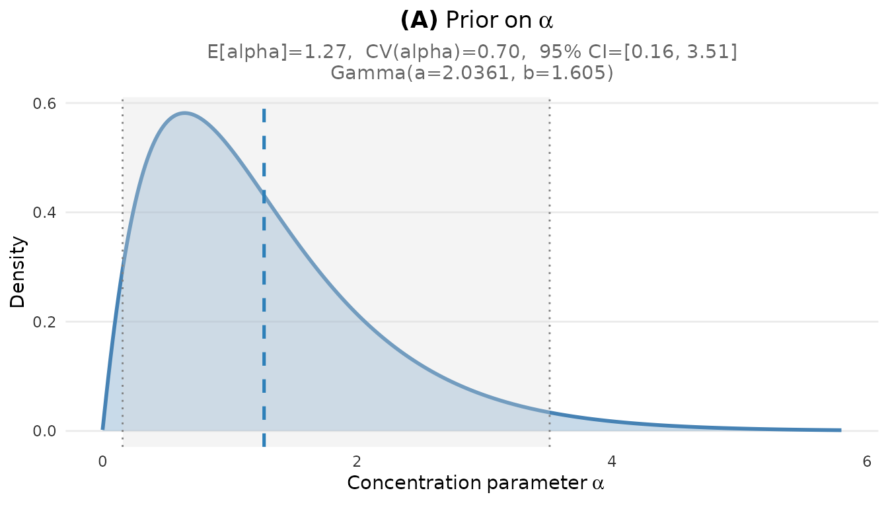
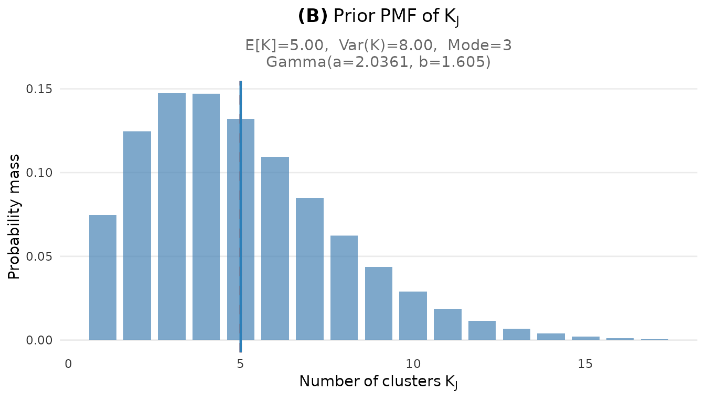
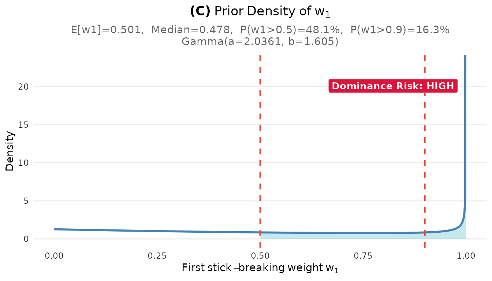

# Diagnosing Your Prior: Avoiding Unintended Consequences

## Overview

When you elicit a Gamma hyperprior for $\alpha$ based on your
expectations about the number of clusters $K_{J}$, you are implicitly
specifying priors on *many other quantities* that you may not have
consciously considered. These “unintended priors” can lead your
posterior inference in unexpected directions, particularly in
low-information settings where the data cannot overwhelm an
inadvertently strong prior.

This vignette introduces the diagnostic tools in the DPprior package
that help you verify your prior behaves as intended across all relevant
dimensions. By the end, you will understand:

1.  Why diagnostics matter: the “unintended prior” problem
2.  The complete diagnostic suite available in DPprior
3.  How to interpret $\alpha$ and weight distribution diagnostics
4.  The dominance warning system and how to respond to alerts
5.  How to use diagnostics to iteratively refine your prior

## 1. Why Diagnostics Matter

### 1.1 The Blind Spot in Prior Elicitation

The standard workflow for eliciting a DP prior focuses on cluster
counts:

1.  You think about $\mu_{K}$: “How many groups do I expect?”
2.  You think about $\text{Var}(K)$: “How uncertain am I about that?”
3.  You call
    [`DPprior_fit()`](https://joonho112.github.io/DPprior/reference/DPprior_fit.md)
    and obtain $\alpha \sim \text{Gamma}(a,b)$

This is intuitive and principled. However, your elicited prior on
$\alpha$ determines not just $K_{J}$, but also:

- The **distribution of $\alpha$ itself**: mean, variance, and shape
- The **cluster weight distribution**: how mass is allocated across
  clusters
- The **co-clustering probability**: how likely two random observations
  share a cluster
- The **dominance risk**: probability that one cluster contains most of
  the data

These characteristics are implicit consequences of your $(a,b)$ choice.
You may not have intended any particular behavior for these quantities,
yet your prior assigns specific probabilities to them.

### 1.2 The Unintended Prior Problem

[Vicentini & Jermyn (2025)](https://doi.org/10.48550/arXiv.2502.00864)
demonstrated that matching a target $K_{J}$ distribution does not
guarantee intuitive weight behavior. Consider a concrete example:

``` r
J <- 50
mu_K <- 5

# K-only calibration with moderate uncertainty
fit_K <- DPprior_fit(J = J, mu_K = mu_K, confidence = "low")
#> Warning: HIGH DOMINANCE RISK: P(w1 > 0.5) = 56.3% exceeds 40%.
#>   This may indicate unintended prior behavior (Lee, 2026).
#>   Consider using DPprior_dual() for weight-constrained elicitation.
#>   See ?DPprior_diagnostics for interpretation.

cat("K-only prior: Gamma(", round(fit_K$a, 3), ", ", round(fit_K$b, 3), ")\n", sep = "")
#> K-only prior: Gamma(0.518, 0.341)
cat("\nCluster count behavior:\n")
#> 
#> Cluster count behavior:
cat("  E[K] =", round(exact_K_moments(J, fit_K$a, fit_K$b)$mean, 2), "\n")
#>   E[K] = 5
cat("  This matches our target of", mu_K, "clusters.\n")
#>   This matches our target of 5 clusters.

cat("\nBut what about weight behavior?\n")
#> 
#> But what about weight behavior?
cat("  E[w₁] =", round(mean_w1(fit_K$a, fit_K$b), 3), "\n")
#>   E[w₁] = 0.585
cat("  P(w₁ > 0.3) =", round(prob_w1_exceeds(0.3, fit_K$a, fit_K$b), 3), "\n")
#>   P(w₁ > 0.3) = 0.69
cat("  P(w₁ > 0.5) =", round(prob_w1_exceeds(0.5, fit_K$a, fit_K$b), 3), "\n")
#>   P(w₁ > 0.5) = 0.563
cat("  P(w₁ > 0.9) =", round(prob_w1_exceeds(0.9, fit_K$a, fit_K$b), 3), "\n")
#>   P(w₁ > 0.9) = 0.346
```

The prior expects 5 clusters, but there is a substantial probability
(nearly 50%) that a randomly selected observation belongs to a cluster
containing more than half of all observations. Is this what you intended
when you said “I expect 5 clusters”?

Most researchers, when they think “5 clusters,” imagine something like
five roughly comparable groups—not a situation where one cluster might
dominate the entire mixture.

### 1.3 Why This Matters in Practice

The unintended prior problem is especially consequential in
**low-information settings** ([Lee et al.,
2025](https://doi.org/10.3102/10769986241254286)):

- **Multisite trials with few sites**: When $J$ is moderate (20–100),
  each site provides limited data
- **Sparse clustering applications**: When observations per cluster are
  small
- **Exploratory analyses**: When you don’t have strong prior data to
  inform expectations

In these settings, the posterior can remain close to the prior. If your
prior inadvertently favors a single dominant cluster, your posterior may
inherit this behavior even when the data suggest otherwise.

## 2. The Complete Diagnostic Suite

The DPprior package provides a comprehensive set of diagnostics that you
can access in several ways.

### 2.1 Automatic Diagnostics During Fitting

The simplest approach is to enable diagnostics during the fitting
process:

``` r
fit <- DPprior_fit(J = 50, mu_K = 5, var_K = 8, check_diagnostics = TRUE)
#> Warning: HIGH DOMINANCE RISK: P(w1 > 0.5) = 48.1% exceeds 40%.
#>   This may indicate unintended prior behavior (Lee, 2026).
#>   Consider using DPprior_dual() for weight-constrained elicitation.
#>   See ?DPprior_diagnostics for interpretation.
```

When `check_diagnostics = TRUE`, the function computes all diagnostic
quantities and stores them in the returned object.

### 2.2 Post-Hoc Diagnostic Computation

You can also compute diagnostics after fitting:

``` r
# Fit without diagnostics first
fit <- DPprior_fit(J = 50, mu_K = 5, var_K = 8)
#> Warning: HIGH DOMINANCE RISK: P(w1 > 0.5) = 48.1% exceeds 40%.
#>   This may indicate unintended prior behavior (Lee, 2026).
#>   Consider using DPprior_dual() for weight-constrained elicitation.
#>   See ?DPprior_diagnostics for interpretation.

# Then compute diagnostics
diag <- DPprior_diagnostics(fit)
print(diag)
#> DPprior Comprehensive Diagnostics
#> ============================================================ 
#> 
#> Prior: alpha ~ Gamma(2.0361, 1.6051) for J = 50
#> 
#> alpha Distribution:
#> ---------------------------------------- 
#>   E[alpha] = 1.269, CV(alpha) = 0.701, Median = 1.068
#>   90% CI: [0.230, 2.992]
#> 
#> K_J Distribution:
#> ---------------------------------------- 
#>   E[K] = 5.00, SD(K) = 2.83, Mode = 3
#>   Median = 5, IQR = [3, 7]
#> 
#> w1 Distribution (Size-Biased First Weight):
#> ---------------------------------------- 
#>   E[w1] = 0.501, Median = 0.478
#>   P(w1 > 0.5) = 48.1% (dominance risk: HIGH)
#>   P(w1 > 0.9) = 16.3%
#> 
#> Co-Clustering (rho = sum w_h^2):
#> ---------------------------------------- 
#>   E[rho] = 0.501 (High prior co-clustering: most unit pairs expected in same cluster)
#> 
#> WARNINGS:
#> ---------------------------------------- 
#>   * HIGH DOMINANCE RISK: P(w1 > 0.5) = 48.1% exceeds 40%
#>   * NEAR-DEGENERATE RISK: P(w1 > 0.9) = 16.3% exceeds 15%
#> 
#>   Consider using DPprior_dual() for weight-constrained elicitation.
```

### 2.3 Overview of Diagnostic Components

The diagnostic object contains several components:

| Component      | Description                                                                 |
|----------------|-----------------------------------------------------------------------------|
| `alpha`        | Properties of the $\alpha$ prior (mean, SD, CV, quantiles)                  |
| `K`            | Properties of the $K_{J}$ marginal (mean, variance, mode, PMF)              |
| `weights`      | First stick-breaking weight distribution (mean, median, tail probabilities) |
| `coclustering` | Co-clustering probability summary                                           |
| `warnings`     | Character vector of any diagnostic warnings                                 |

Let us examine each component in detail.

## 3. Alpha Distribution Diagnostics

The first set of diagnostics concerns the concentration parameter
$\alpha$ itself. Since $\alpha \sim \text{Gamma}(a,b)$, we can compute
all moments analytically.

### 3.1 Accessing Alpha Diagnostics

``` r
fit <- DPprior_fit(J = 50, mu_K = 5, var_K = 8)
#> Warning: HIGH DOMINANCE RISK: P(w1 > 0.5) = 48.1% exceeds 40%.
#>   This may indicate unintended prior behavior (Lee, 2026).
#>   Consider using DPprior_dual() for weight-constrained elicitation.
#>   See ?DPprior_diagnostics for interpretation.
diag <- DPprior_diagnostics(fit)

cat("Alpha distribution summary:\n")
#> Alpha distribution summary:
cat("  Mean:     E[α] =", round(diag$alpha$mean, 4), "\n")
#>   Mean:     E[α] = 1.2686
cat("  SD:       SD(α) =", round(diag$alpha$sd, 4), "\n")
#>   SD:       SD(α) = 0.889
cat("  CV:       CV(α) =", round(diag$alpha$cv, 4), "\n")
#>   CV:       CV(α) = 0.7008
cat("\nQuantiles:\n")
#> 
#> Quantiles:
cat("   5th percentile:", round(diag$alpha$quantiles["q5"], 4), "\n")
#>    5th percentile: 0.2305
cat("  25th percentile:", round(diag$alpha$quantiles["q25"], 4), "\n")
#>   25th percentile: 0.6155
cat("  50th percentile:", round(diag$alpha$quantiles["q50"], 4), "\n")
#>   50th percentile: 1.068
cat("  75th percentile:", round(diag$alpha$quantiles["q75"], 4), "\n")
#>   75th percentile: 1.7058
cat("  95th percentile:", round(diag$alpha$quantiles["q95"], 4), "\n")
#>   95th percentile: 2.992
```

### 3.2 Interpreting the Coefficient of Variation

The coefficient of variation (CV) of $\alpha$ is particularly
informative:

| CV Range        | Interpretation                                                 |
|-----------------|----------------------------------------------------------------|
| CV \< 0.3       | **Highly informative**: You are quite certain about $\alpha$   |
| 0.3 ≤ CV \< 0.5 | **Moderately informative**: Reasonable uncertainty             |
| 0.5 ≤ CV \< 1.0 | **Weakly informative**: Substantial uncertainty about $\alpha$ |
| CV ≥ 1.0        | **Highly diffuse**: Very uncertain about $\alpha$              |

For a Gamma distribution, $\text{CV}(\alpha) = 1/\sqrt{a}$, so the CV
depends only on the shape parameter $a$.

``` r
# Compare different CV levels
a_values <- c(0.5, 1, 2, 4, 10)
cv_values <- 1 / sqrt(a_values)

alpha_grid <- seq(0.01, 8, length.out = 300)
cv_df <- do.call(rbind, lapply(seq_along(a_values), function(i) {
  a <- a_values[i]
  # Use b = a so E[alpha] = 1 for all
  b <- a
  data.frame(
    alpha = alpha_grid,
    density = dgamma(alpha_grid, shape = a, rate = b),
    CV = sprintf("CV = %.2f (a = %.1f)", cv_values[i], a)
  )
}))
cv_df$CV <- factor(cv_df$CV, levels = unique(cv_df$CV))

ggplot(cv_df, aes(x = alpha, y = density, color = CV)) +
  geom_line(linewidth = 1) +
  scale_color_viridis_d(option = "plasma", end = 0.85) +
  labs(
    x = expression(alpha),
    y = "Density",
    title = "Prior Informativeness Controlled by Shape Parameter",
    subtitle = "All priors have E[α] = 1; higher a means lower CV (more informative)"
  ) +
  theme_minimal() +
  theme(legend.position = "right")
```


Different levels of informativeness in the α prior, controlled by the
shape parameter a.

## 4. Weight Distribution Diagnostics

The weight diagnostics are crucial for detecting unintended prior
behavior. The DPprior package provides comprehensive diagnostics for the
first stick-breaking weight $w_{1}$.

### 4.1 Understanding $w_{1}$

Recall from the [Dual-Anchor
vignette](https://joonho112.github.io/DPprior/articles/dual-anchor.md)
that under Sethuraman’s stick-breaking representation:

$$w_{1} = v_{1},\quad v_{1} \mid \alpha \sim \text{Beta}(1,\alpha)$$

The quantity $w_{1}$ has a natural interpretation: it is the
**proportion of the cluster containing a randomly selected
observation**. If $P\left( w_{1} > 0.5 \right)$ is high, a random
observation is likely to belong to a cluster containing more than half
of all observations.

### 4.2 Accessing Weight Diagnostics

``` r
cat("Weight distribution summary:\n")
#> Weight distribution summary:
cat("  E[w₁] =", round(diag$weights$mean, 4), "\n")
#>   E[w₁] = 0.5014
cat("  Median(w₁) =", round(diag$weights$median, 4), "\n")
#>   Median(w₁) = 0.4784

cat("\nDominance tail probabilities:\n")
#> 
#> Dominance tail probabilities:
cat("  P(w₁ > 0.3) =", round(diag$weights$prob_exceeds["prob_gt_0.3"], 4), "\n")
#>   P(w₁ > 0.3) = NA
cat("  P(w₁ > 0.5) =", round(diag$weights$prob_exceeds["prob_gt_0.5"], 4), "\n")
#>   P(w₁ > 0.5) = 0.4815
cat("  P(w₁ > 0.7) =", round(diag$weights$prob_exceeds["prob_gt_0.7"], 4), "\n")
#>   P(w₁ > 0.7) = NA
cat("  P(w₁ > 0.9) =", round(diag$weights$prob_exceeds["prob_gt_0.9"], 4), "\n")
#>   P(w₁ > 0.9) = 0.1634

cat("\nDominance risk level:", toupper(diag$weights$dominance_risk), "\n")
#> 
#> Dominance risk level: HIGH
```

### 4.3 Closed-Form Calculations

All $w_{1}$ diagnostics are computed using closed-form expressions
(derived in [Lee, 2026](https://arxiv.org/abs/2602.06301), following
[Vicentini & Jermyn, 2025](https://doi.org/10.48550/arXiv.2502.00864)):

**CDF:**
$$F_{w_{1}}(x \mid a,b) = 1 - \left( \frac{b}{b - \log(1 - x)} \right)^{a}$$

**Quantile function:**
$$Q_{w_{1}}(u \mid a,b) = 1 - \exp\left( b\left\lbrack 1 - (1 - u)^{- 1/a} \right\rbrack \right)$$

**Tail probability (dominance risk):**
$$P\left( w_{1} > t \mid a,b \right) = \left( \frac{b}{b - \log(1 - t)} \right)^{a}$$

You can access these functions directly:

``` r
a <- fit$a
b <- fit$b

# Direct computation of tail probabilities
cat("Direct computation of P(w₁ > t):\n")
#> Direct computation of P(w₁ > t):
for (t in c(0.3, 0.5, 0.7, 0.9)) {
  p <- prob_w1_exceeds(t, a, b)
  cat(sprintf("  P(w₁ > %.1f) = %.4f\n", t, p))
}
#>   P(w₁ > 0.3) = 0.6646
#>   P(w₁ > 0.5) = 0.4815
#>   P(w₁ > 0.7) = 0.3200
#>   P(w₁ > 0.9) = 0.1634

# Quantiles
cat("\nQuantiles of w₁ distribution:\n")
#> 
#> Quantiles of w₁ distribution:
for (q in c(0.25, 0.5, 0.75, 0.95)) {
  x <- quantile_w1(q, a, b)
  cat(sprintf("  %d%% quantile: %.4f\n", round(100*q), x))
}
#>   25% quantile: 0.2162
#>   50% quantile: 0.4784
#>   75% quantile: 0.7911
#>   95% quantile: 0.9954
```

## 5. The Dominance Warning System

The DPprior package includes an automatic warning system to alert you
when your prior implies a high probability of cluster dominance.

### 5.1 Dominance Risk Levels

The dominance risk is categorized into three levels based on
$P\left( w_{1} > 0.5 \right)$:

| Risk Level   | Criterion                                      | Interpretation                                                     |
|--------------|------------------------------------------------|--------------------------------------------------------------------|
| **LOW**      | $P\left( w_{1} > 0.5 \right) < 0.20$           | Cluster balance is likely; weights spread across multiple clusters |
| **MODERATE** | $0.20 \leq P\left( w_{1} > 0.5 \right) < 0.40$ | Some chance of dominance; consider your tolerance                  |
| **HIGH**     | $P\left( w_{1} > 0.5 \right) \geq 0.40$        | Substantial dominance risk; action recommended                     |

### 5.2 Enabling Dominance Warnings

You can enable automatic warnings during fitting:

``` r
# A prior with high dominance risk
fit_risky <- DPprior_fit(J = 50, mu_K = 2, var_K = 2, warn_dominance = TRUE)
#> Warning: HIGH DOMINANCE RISK: P(w1 > 0.5) = 85.1% exceeds 40%.
#>   This may indicate unintended prior behavior (Lee, 2026).
#>   Consider using DPprior_dual() for weight-constrained elicitation.
#>   See ?DPprior_diagnostics for interpretation.
```

When `warn_dominance = TRUE`, the function will issue a warning if the
dominance risk is HIGH.

### 5.3 Checking Dominance Risk Manually

You can also check the dominance risk from the diagnostic object:

``` r
diag_risky <- DPprior_diagnostics(fit_risky)

cat("Dominance risk assessment:\n")
#> Dominance risk assessment:
cat("  Risk level:", toupper(diag_risky$weights$dominance_risk), "\n")
#>   Risk level: HIGH
cat("  P(w₁ > 0.5) =", round(diag_risky$weights$prob_exceeds["prob_gt_0.5"], 4), "\n")
#>   P(w₁ > 0.5) = 0.8511
```

### 5.4 What High Dominance Means

A HIGH dominance risk means your prior places substantial probability on
scenarios where a single cluster contains more than half of all
observations. This may or may not be appropriate depending on your
application:

**When high dominance might be appropriate:**

- You genuinely expect most data to fall into one dominant group
- You are modeling rare events where most observations are “baseline”
- You have strong prior evidence of an unbalanced partition

**When high dominance is likely unintended:**

- You expect roughly equal-sized clusters
- You think “$K$ clusters” should mean roughly balanced groups
- You are doing exploratory clustering without strong prior expectations

### 5.5 Responding to High Dominance Warnings

If you receive a high dominance warning and it is unintended, you have
several options:

1.  **Increase $\mu_{K}$**: Expecting more clusters typically reduces
    dominance risk
2.  **Decrease $\text{Var}(K)$**: More certainty about cluster count can
    help
3.  **Use dual-anchor elicitation**: Directly constrain weight behavior

We will demonstrate option 3 in Section 7.

## 6. Visualizing Diagnostics

The DPprior package provides several visualization functions for
understanding your prior.

### 6.1 The Complete Dashboard

The [`plot()`](https://rdrr.io/r/graphics/plot.default.html) method for
a `DPprior_fit` object creates a comprehensive four-panel dashboard:

``` r
fit <- DPprior_fit(J = 50, mu_K = 5, var_K = 8)
#> Warning: HIGH DOMINANCE RISK: P(w1 > 0.5) = 48.1% exceeds 40%.
#>   This may indicate unintended prior behavior (Lee, 2026).
#>   Consider using DPprior_dual() for weight-constrained elicitation.
#>   See ?DPprior_diagnostics for interpretation.
plot(fit)
```


Complete diagnostic dashboard showing all key prior characteristics.

    #> TableGrob (2 x 2) "dpprior_dashboard": 4 grobs
    #>   z     cells              name           grob
    #> 1 1 (1-1,1-1) dpprior_dashboard gtable[layout]
    #> 2 2 (2-2,1-1) dpprior_dashboard gtable[layout]
    #> 3 3 (1-1,2-2) dpprior_dashboard gtable[layout]
    #> 4 4 (2-2,2-2) dpprior_dashboard gtable[layout]

### 6.2 Individual Diagnostic Plots

For more focused analysis, you can create individual plots:

``` r
# Alpha prior density
plot_alpha_prior(fit)
```



``` r
# K marginal PMF
plot_K_prior(fit)
```



``` r
# w1 distribution with dominance thresholds
plot_w1_prior(fit)
```


### 6.3 Comparing Multiple Priors

When considering different prior specifications, you can visualize them
side by side:

``` r
fits <- list(
  "Low uncertainty (var_K = 6)" = DPprior_fit(J = 50, mu_K = 5, var_K = 6),
  "Medium uncertainty (var_K = 10)" = DPprior_fit(J = 50, mu_K = 5, var_K = 10),
  "High uncertainty (var_K = 20)" = DPprior_fit(J = 50, mu_K = 5, var_K = 20)
)
#> Warning: HIGH DOMINANCE RISK: P(w1 > 0.5) = 46.5% exceeds 40%.
#>   This may indicate unintended prior behavior (Lee, 2026).
#>   Consider using DPprior_dual() for weight-constrained elicitation.
#>   See ?DPprior_diagnostics for interpretation.
#> Warning: HIGH DOMINANCE RISK: P(w1 > 0.5) = 49.7% exceeds 40%.
#>   This may indicate unintended prior behavior (Lee, 2026).
#>   Consider using DPprior_dual() for weight-constrained elicitation.
#>   See ?DPprior_diagnostics for interpretation.
#> Warning: HIGH DOMINANCE RISK: P(w1 > 0.5) = 56.3% exceeds 40%.
#>   This may indicate unintended prior behavior (Lee, 2026).
#>   Consider using DPprior_dual() for weight-constrained elicitation.
#>   See ?DPprior_diagnostics for interpretation.

# Compute log Stirling numbers for efficiency
logS <- compute_log_stirling(50)

# Build comparison data
k_df <- do.call(rbind, lapply(names(fits), function(nm) {
  fit <- fits[[nm]]
  pmf <- pmf_K_marginal(50, fit$a, fit$b, logS = logS)
  data.frame(
    K = seq_along(pmf) - 1,  # pmf_K_marginal returns k=0,...,J
    probability = pmf,
    Prior = nm
  )
}))
k_df <- k_df[k_df$K >= 1, ]  # Remove k=0
k_df$Prior <- factor(k_df$Prior, levels = names(fits))

# Plot
ggplot(k_df[k_df$K <= 20, ], aes(x = K, y = probability, color = Prior)) +
  geom_point(size = 2) +
  geom_line(linewidth = 0.8) +
  scale_color_manual(values = palette_3) +
  labs(
    x = expression(Number~of~clusters~K[J]),
    y = "Probability",
    title = "Prior PMF of K Under Different Variance Assumptions",
    subtitle = "All priors have μ_K = 5; higher variance spreads the distribution"
  ) +
  theme_minimal() +
  theme(legend.position = "bottom", legend.title = element_blank())
```


Comparison of K distributions under different variance assumptions.

## 7. Diagnostic-Driven Refinement

The diagnostic tools enable an iterative workflow for refining your
prior until it matches your intentions across all dimensions.

### 7.1 The Refinement Workflow

The recommended workflow is:

1.  **Start with K-only calibration**: Use
    [`DPprior_fit()`](https://joonho112.github.io/DPprior/reference/DPprior_fit.md)
    with your expectations about cluster counts
2.  **Run diagnostics**: Check the implied behavior on $\alpha$,
    $w_{1}$, and dominance
3.  **Identify mismatches**: Does any aspect of the prior surprise you?
4.  **Refine**: Adjust parameters or use dual-anchor if needed
5.  **Repeat**: Until all aspects of the prior match your intentions

### 7.2 Complete Example: From Problem to Solution

Let us walk through a complete example of diagnostic-driven refinement.

**Step 1: Initial K-only prior**

``` r
# Researcher expects ~5 clusters with moderate uncertainty
fit1 <- DPprior_fit(J = 50, mu_K = 5, var_K = 8)
#> Warning: HIGH DOMINANCE RISK: P(w1 > 0.5) = 48.1% exceeds 40%.
#>   This may indicate unintended prior behavior (Lee, 2026).
#>   Consider using DPprior_dual() for weight-constrained elicitation.
#>   See ?DPprior_diagnostics for interpretation.

cat("Step 1: Initial K-only prior\n")
#> Step 1: Initial K-only prior
cat("Gamma(a =", round(fit1$a, 4), ", b =", round(fit1$b, 4), ")\n\n")
#> Gamma(a = 2.0361 , b = 1.6051 )
```

**Step 2: Run diagnostics**

``` r
diag1 <- DPprior_diagnostics(fit1)

cat("Step 2: Diagnostics reveal...\n")
#> Step 2: Diagnostics reveal...
cat("  K behavior: E[K] =", round(diag1$K$mean, 2), 
    ", Var(K) =", round(diag1$K$var, 2), "✓\n")
#>   K behavior: E[K] = 5 , Var(K) = 8 ✓
cat("  Weight behavior: P(w₁ > 0.5) =", 
    round(diag1$weights$prob_exceeds["prob_gt_0.5"], 3), "\n")
#>   Weight behavior: P(w₁ > 0.5) = 0.481
cat("  Dominance risk:", toupper(diag1$weights$dominance_risk), "\n")
#>   Dominance risk: HIGH
```

**Step 3: Identify the problem**

``` r
plot_w1_prior(fit1)
```

    #> Step 3: Problem identification
    #>   The researcher wanted: ~5 clusters with balanced weights
    #>   The prior implies: ~5 clusters but high chance of one dominant cluster
    #>   P(w₁ > 0.5) = 48 % is higher than expected for 'balanced' clusters



**Step 4: Apply dual-anchor refinement**

``` r
cat("Step 4: Dual-anchor refinement\n")
#> Step 4: Dual-anchor refinement
cat("  Adding constraint: P(w₁ > 0.5) ≤ 0.25\n\n")
#>   Adding constraint: P(w₁ > 0.5) ≤ 0.25

fit2 <- DPprior_dual(
  fit = fit1,
  w1_target = list(prob = list(threshold = 0.5, value = 0.25)),
  lambda = 0.7,
  loss_type = "adaptive",
  verbose = FALSE
)

cat("Refined prior: Gamma(a =", round(fit2$a, 4), ", b =", round(fit2$b, 4), ")\n")
#> Refined prior: Gamma(a = 4.3948 , b = 2.5043 )
```

**Step 5: Re-run diagnostics**

``` r
diag2 <- DPprior_diagnostics(fit2)

cat("Step 5: Post-refinement diagnostics\n")
#> Step 5: Post-refinement diagnostics
cat("  K behavior: E[K] =", round(diag2$K$mean, 2), 
    " (shifted from target of 5)\n")
#>   K behavior: E[K] = 6.3  (shifted from target of 5)
cat("  Weight behavior: P(w₁ > 0.5) =", 
    round(diag2$weights$prob_exceeds["prob_gt_0.5"], 3), "✓\n")
#>   Weight behavior: P(w₁ > 0.5) = 0.342 ✓
cat("  Dominance risk:", toupper(diag2$weights$dominance_risk), "✓\n")
#>   Dominance risk: MODERATE ✓
```

**Step 6: Visualize the improvement**

``` r
# Compare w1 distributions
x_grid <- seq(0.001, 0.999, length.out = 500)
w1_df <- data.frame(
  x = rep(x_grid, 2),
  density = c(
    density_w1(x_grid, fit1$a, fit1$b),
    density_w1(x_grid, fit2$a, fit2$b)
  ),
  Prior = rep(c("K-only (before)", "Dual-anchor (after)"), each = length(x_grid))
)
w1_df$Prior <- factor(w1_df$Prior, levels = c("K-only (before)", "Dual-anchor (after)"))

# Cap extreme densities for visualization
w1_df$density[w1_df$density > 10] <- NA

ggplot(w1_df, aes(x = x, y = density, color = Prior)) +
  geom_line(linewidth = 1, na.rm = TRUE) +
  geom_vline(xintercept = 0.5, linetype = "dashed", color = "gray50") +
  scale_color_manual(values = c("#E41A1C", "#377EB8")) +
  annotate("text", x = 0.52, y = 5, label = "P(w₁ > 0.5)", hjust = 0, color = "gray40") +
  labs(
    x = expression(w[1]),
    y = "Density",
    title = "Weight Distribution: Before and After Dual-Anchor Refinement",
    subtitle = sprintf("P(w₁ > 0.5): Before = %.0f%%, After = %.0f%%",
                       100 * diag1$weights$prob_exceeds["prob_gt_0.5"],
                       100 * diag2$weights$prob_exceeds["prob_gt_0.5"])
  ) +
  coord_cartesian(xlim = c(0, 1), ylim = c(0, 6)) +
  theme_minimal() +
  theme(legend.position = "bottom", legend.title = element_blank())
```


Comparison of weight distributions before and after dual-anchor
refinement.

### 7.3 Summary of the Refinement

``` r
comparison_df <- data.frame(
  Metric = c("Gamma(a, b)", "E[K]", "Var(K)", "E[w₁]", 
             "P(w₁ > 0.5)", "Dominance Risk"),
  Before = c(
    sprintf("(%.3f, %.3f)", fit1$a, fit1$b),
    sprintf("%.2f", diag1$K$mean),
    sprintf("%.2f", diag1$K$var),
    sprintf("%.3f", diag1$weights$mean),
    sprintf("%.1f%%", 100 * diag1$weights$prob_exceeds["prob_gt_0.5"]),
    toupper(diag1$weights$dominance_risk)
  ),
  After = c(
    sprintf("(%.3f, %.3f)", fit2$a, fit2$b),
    sprintf("%.2f", diag2$K$mean),
    sprintf("%.2f", diag2$K$var),
    sprintf("%.3f", diag2$weights$mean),
    sprintf("%.1f%%", 100 * diag2$weights$prob_exceeds["prob_gt_0.5"]),
    toupper(diag2$weights$dominance_risk)
  )
)

knitr::kable(
  comparison_df,
  col.names = c("Metric", "K-only", "Dual-anchor"),
  caption = "Comparison of prior specifications before and after dual-anchor refinement"
)
```

| Metric         | K-only         | Dual-anchor    |
|:---------------|:---------------|:---------------|
| Gamma(a, b)    | (2.036, 1.605) | (4.395, 2.504) |
| E\[K\]         | 5.00           | 6.30           |
| Var(K)         | 8.00           | 7.72           |
| E\[w₁\]        | 0.501          | 0.396          |
| P(w₁ \> 0.5)   | 48.1%          | 34.2%          |
| Dominance Risk | HIGH           | MODERATE       |

Comparison of prior specifications before and after dual-anchor
refinement

The trade-off is clear: the refined prior has slightly higher E\[K\]
than the original target of 5, but now has appropriately controlled
weight behavior. This is the Pareto trade-off that the dual-anchor
framework makes explicit.

## 8. Comparative Diagnostics

When evaluating multiple candidate priors, comparative diagnostics help
you understand the trade-offs.

### 8.1 Comparing Multiple Priors

``` r
# Define three candidate priors
candidates <- list(
  "Conservative" = DPprior_fit(J = 50, mu_K = 5, var_K = 6),
  "Moderate" = DPprior_fit(J = 50, mu_K = 5, var_K = 10),
  "Diffuse" = DPprior_fit(J = 50, mu_K = 5, var_K = 20)
)
#> Warning: HIGH DOMINANCE RISK: P(w1 > 0.5) = 46.5% exceeds 40%.
#>   This may indicate unintended prior behavior (Lee, 2026).
#>   Consider using DPprior_dual() for weight-constrained elicitation.
#>   See ?DPprior_diagnostics for interpretation.
#> Warning: HIGH DOMINANCE RISK: P(w1 > 0.5) = 49.7% exceeds 40%.
#>   This may indicate unintended prior behavior (Lee, 2026).
#>   Consider using DPprior_dual() for weight-constrained elicitation.
#>   See ?DPprior_diagnostics for interpretation.
#> Warning: HIGH DOMINANCE RISK: P(w1 > 0.5) = 56.3% exceeds 40%.
#>   This may indicate unintended prior behavior (Lee, 2026).
#>   Consider using DPprior_dual() for weight-constrained elicitation.
#>   See ?DPprior_diagnostics for interpretation.

# Compute diagnostics for each
comp_results <- lapply(names(candidates), function(nm) {
  fit <- candidates[[nm]]
  diag <- DPprior_diagnostics(fit)
  data.frame(
    Prior = nm,
    a = round(fit$a, 3),
    b = round(fit$b, 3),
    E_K = round(diag$K$mean, 2),
    Var_K = round(diag$K$var, 2),
    E_w1 = round(diag$weights$mean, 3),
    P_w1_gt_50 = sprintf("%.1f%%", 100 * diag$weights$prob_exceeds["prob_gt_0.5"]),
    Risk = toupper(diag$weights$dominance_risk)
  )
})

comp_df <- do.call(rbind, comp_results)

knitr::kable(
  comp_df,
  col.names = c("Prior", "a", "b", "E[K]", "Var(K)", "E[w₁]", "P(w₁>0.5)", "Risk"),
  caption = "Comparative diagnostics for three candidate priors"
)
```

| Prior        |     a |     b | E\[K\] | Var(K) | E\[w₁\] | P(w₁\>0.5) | Risk |
|:-------------|------:|------:|-------:|-------:|--------:|:-----------|:-----|
| Conservative | 3.568 | 2.900 |      5 |      6 |   0.484 | 46.5%      | HIGH |
| Moderate     | 1.408 | 1.077 |      5 |     10 |   0.518 | 49.7%      | HIGH |
| Diffuse      | 0.518 | 0.341 |      5 |     20 |   0.585 | 56.3%      | HIGH |

Comparative diagnostics for three candidate priors

### 8.2 Visualizing the Comparison

``` r
# Create comparison data for w1
w1_comp_df <- do.call(rbind, lapply(names(candidates), function(nm) {
  fit <- candidates[[nm]]
  x <- seq(0.001, 0.999, length.out = 300)
  d <- density_w1(x, fit$a, fit$b)
  d[d > 8] <- NA
  data.frame(x = x, density = d, Prior = nm)
}))
w1_comp_df$Prior <- factor(w1_comp_df$Prior, levels = names(candidates))

p1 <- ggplot(w1_comp_df, aes(x = x, y = density, color = Prior)) +
  geom_line(linewidth = 1, na.rm = TRUE) +
  geom_vline(xintercept = 0.5, linetype = "dashed", color = "gray60") +
  scale_color_manual(values = palette_3) +
  coord_cartesian(xlim = c(0, 1), ylim = c(0, 5)) +
  labs(x = expression(w[1]), y = "Density", 
       title = expression("Prior on " * w[1])) +
  theme_minimal() +
  theme(legend.position = "bottom", legend.title = element_blank())

# Create comparison data for K
logS <- compute_log_stirling(50)
k_comp_df <- do.call(rbind, lapply(names(candidates), function(nm) {
  fit <- candidates[[nm]]
  pmf <- pmf_K_marginal(50, fit$a, fit$b, logS = logS)
  data.frame(k = seq_along(pmf) - 1, pmf = pmf, Prior = nm)
}))
k_comp_df <- k_comp_df[k_comp_df$k >= 1, ]
k_comp_df$Prior <- factor(k_comp_df$Prior, levels = names(candidates))

p2 <- ggplot(k_comp_df[k_comp_df$k <= 15, ], 
             aes(x = k, y = pmf, color = Prior)) +
  geom_point(size = 2) +
  geom_line(linewidth = 0.8) +
  scale_color_manual(values = palette_3) +
  labs(x = expression(K[J]), y = "Probability", 
       title = expression("Prior PMF of " * K[J])) +
  theme_minimal() +
  theme(legend.position = "bottom", legend.title = element_blank())

gridExtra::grid.arrange(p1, p2, ncol = 2)
```


Comparison of three candidate priors across multiple dimensions.

## Summary

| Diagnostic Aspect | What to Check                              | Concern If…                                                        |
|-------------------|--------------------------------------------|--------------------------------------------------------------------|
| $\alpha$ CV       | `diag$alpha$cv`                            | CV \> 1 (very diffuse) or CV \< 0.3 (very tight) without intention |
| E\[K\]            | `diag$K$mean`                              | Differs substantially from your target $\mu_{K}$                   |
| Var(K)            | `diag$K$var`                               | Differs substantially from your target or implied variance         |
| P(w₁ \> 0.5)      | `diag$weights$prob_exceeds["prob_gt_0.5"]` | \> 40% without intending high dominance                            |
| Dominance Risk    | `diag$weights$dominance_risk`              | “high” when you expect balanced clusters                           |

**Key Takeaways:**

1.  **Always run diagnostics** after eliciting a prior, especially for
    weight-related quantities
2.  **K-calibration is necessary but not sufficient**: matching E\[K\]
    does not guarantee intuitive weight behavior
3.  **Use the dominance warning system** to catch potential problems
    early
4.  **Apply dual-anchor refinement** when you need to constrain weight
    behavior explicitly
5.  **Iterate until satisfied**: prior elicitation is an iterative
    process

## What’s Next?

- **[Dual-Anchor
  Framework](https://joonho112.github.io/DPprior/articles/dual-anchor.md)**:
  Deep dive into controlling both cluster counts and weight behavior

- **[Case
  Studies](https://joonho112.github.io/DPprior/articles/case-studies.md)**:
  Real-world examples of diagnostic-driven prior refinement

- **[Theory
  Overview](https://joonho112.github.io/DPprior/articles/theory-overview.md)**:
  Mathematical foundations of the diagnostic quantities

## References

Lee, J., Che, J., Rabe-Hesketh, S., Feller, A., & Miratrix, L. (2025).
Improving the estimation of site-specific effects and their distribution
in multisite trials. *Journal of Educational and Behavioral Statistics*,
50(5), 731–764. <https://doi.org/10.3102/10769986241254286>

Vicentini, S., & Jermyn, I. H. (2025). Prior selection for the precision
parameter of Dirichlet process mixture models. *arXiv:2502.00864*.
<https://doi.org/10.48550/arXiv.2502.00864>

Sethuraman, J. (1994). A constructive definition of Dirichlet priors.
*Statistica Sinica*, 4(2), 639–650.

------------------------------------------------------------------------

*For questions or feedback, please visit the [GitHub
repository](https://github.com/joonho112/DPprior).*
