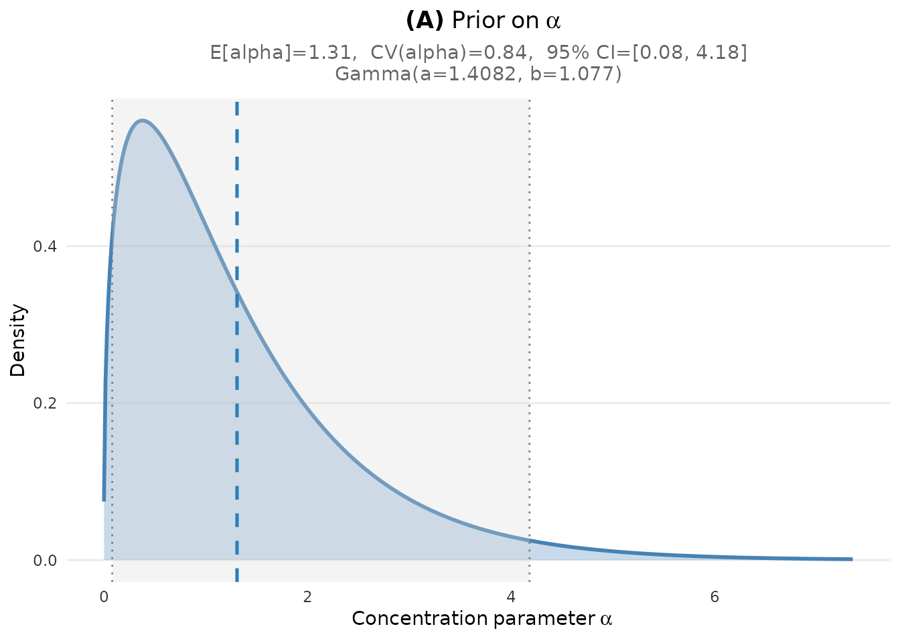
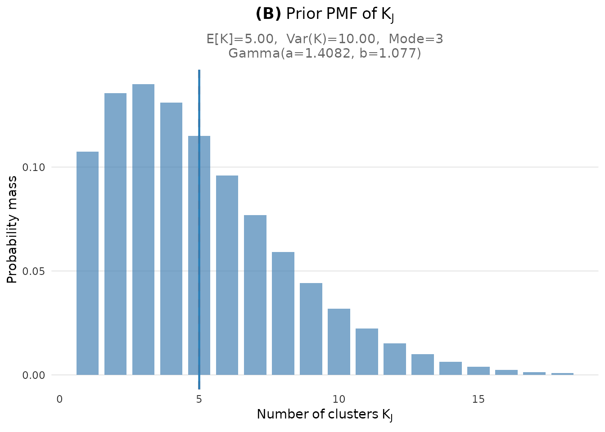
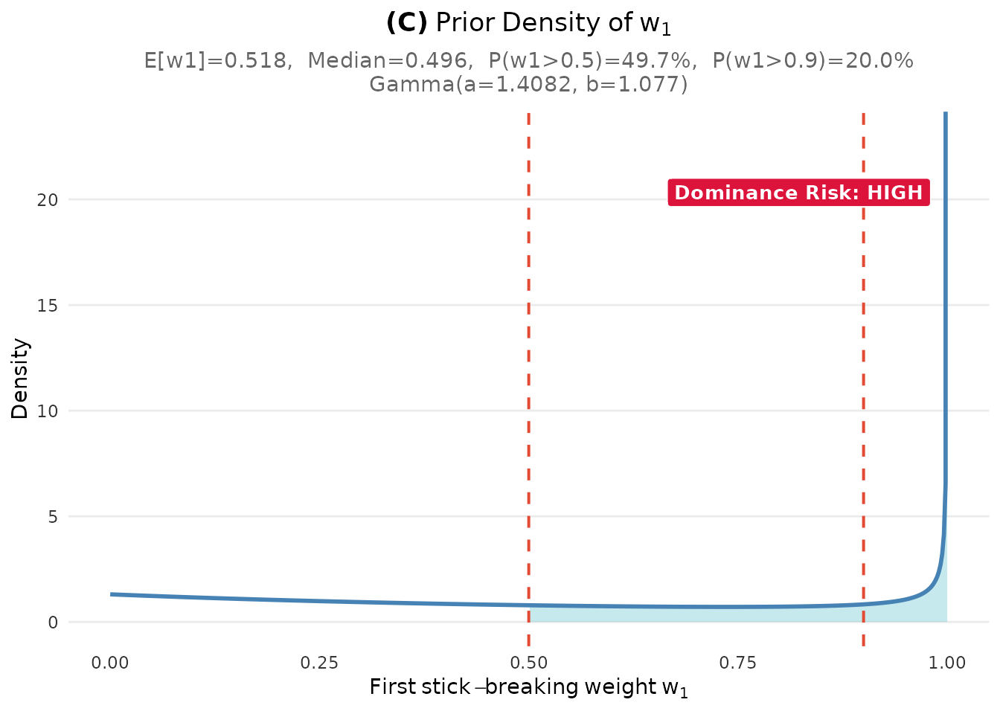

# Quick Start: Your First Prior in 5 Minutes

## Overview

This vignette demonstrates the fastest path to eliciting a Gamma
hyperprior for the concentration parameter $\alpha$ in a Dirichlet
Process mixture model. By the end of this 5-minute tutorial, you will be
able to:

1.  Specify your prior belief about the number of clusters
2.  Convert that belief into Gamma hyperparameters
3.  Visualize and verify your elicited prior

## 1. Minimal Example

Let’s walk through a concrete scenario. Suppose you are analyzing a
multisite educational trial with 50 sites, and you expect that these
sites will cluster into approximately 5 distinct effect groups. This
setup mirrors the “DP-inform” prior elicitation approach used in [Lee et
al. (2025)](https://doi.org/10.3102/10769986241254286), who demonstrated
the benefits of informative Dirichlet Process priors for estimating
site-specific effects in multisite trials. While that paper relied on
chi-square discrepancy measures with computationally intensive grid
search, the DPprior package provides **instant, closed-form solutions**
for the same elicitation task.

``` r
library(DPprior)

# Just two inputs needed:
# 1. J: Number of sites (or observations for clustering)
# 2. mu_K: Expected number of clusters

fit <- DPprior_fit(J = 50, mu_K = 5, confidence = "medium")
#> Warning: HIGH DOMINANCE RISK: P(w1 > 0.5) = 49.7% exceeds 40%.
#>   This may indicate unintended prior behavior (Lee, 2026).
#>   Consider using DPprior_dual() for weight-constrained elicitation.
#>   See ?DPprior_diagnostics for interpretation.

# View the result
print(fit)
#> DPprior Prior Elicitation Result
#> ============================================= 
#> 
#> Gamma Hyperprior: α ~ Gamma(a = 1.4082, b = 1.0770)
#>   E[α] = 1.308, SD[α] = 1.102
#> 
#> Target (J = 50):
#>   E[K_J]   = 5.00
#>   Var(K_J) = 10.00
#>   (from confidence = 'medium')
#> 
#> Achieved:
#>   E[K_J] = 5.000000, Var(K_J) = 10.000000
#>   Residual = 3.94e-10
#> 
#> Method: A2-MN (7 iterations)
#> 
#> Dominance Risk: HIGH ✘ (P(w₁>0.5) = 50%)
```

That’s it! You now have a principled Gamma hyperprior for $\alpha$.

## 2. Understanding the Output

The
[`DPprior_fit()`](https://joonho112.github.io/DPprior/reference/DPprior_fit.md)
function returns an object containing the Gamma hyperparameters and
diagnostic information. Let’s examine the key components:

``` r
# The Gamma hyperparameters
cat("Gamma shape (a):", round(fit$a, 4), "\n")
#> Gamma shape (a): 1.4082
cat("Gamma rate  (b):", round(fit$b, 4), "\n")
#> Gamma rate  (b): 1.077

# What these imply about alpha
alpha_mean <- fit$a / fit$b
alpha_sd <- sqrt(fit$a) / fit$b
cat("\nPrior mean of α:", round(alpha_mean, 3), "\n")
#> 
#> Prior mean of α: 1.308
cat("Prior SD of α:  ", round(alpha_sd, 3), "\n")
#> Prior SD of α:   1.102

# The target specification
cat("\nTarget E[K]:", fit$target$mu_K, "\n")
#> 
#> Target E[K]: 5
cat("Target Var(K):", round(fit$target$var_K, 2), "\n")
#> Target Var(K): 10
```

**Interpretation**: The elicited prior $\alpha \sim \text{Gamma}(a,b)$
implies that you expect around 5 clusters when sampling $J = 50$
observations, with uncertainty captured by the variance.

## 3. Visualizing Your Prior

The DPprior package provides built-in visualization functions to help
you understand and communicate your elicited prior.

### 3.1 Full Dashboard View

The [`plot()`](https://rdrr.io/r/graphics/plot.default.html) method
displays a comprehensive four-panel dashboard:

``` r
plot(fit)
```


Prior elicitation dashboard showing the distributions of α, K, and w₁.

    #> TableGrob (2 x 2) "dpprior_dashboard": 4 grobs
    #>   z     cells              name           grob
    #> 1 1 (1-1,1-1) dpprior_dashboard gtable[layout]
    #> 2 2 (2-2,1-1) dpprior_dashboard gtable[layout]
    #> 3 3 (1-1,2-2) dpprior_dashboard gtable[layout]
    #> 4 4 (2-2,2-2) dpprior_dashboard gtable[layout]

The dashboard includes:

- **Panel (A)**: The Gamma prior density for the concentration parameter
  $\alpha$, with key statistics (mean, CV, 95% CI)
- **Panel (B)**: The implied marginal PMF of the number of clusters
  $K_{J}$, showing E\[K\], Var(K), and mode
- **Panel (C)**: The prior density of the first stick-breaking weight
  $w_{1}$, with dominance risk assessment (useful for detecting overly
  concentrated priors)
- **Panel (D)**: Summary statistics table consolidating all key
  diagnostics

### 3.2 Individual Plots

You can also create individual plots for more focused analysis:

``` r
plot_alpha_prior(fit)
```



``` r
plot_K_prior(fit)
```



``` r
plot_w1_prior(fit)
```



## 4. Three Ways to Specify Your Uncertainty

The
[`DPprior_fit()`](https://joonho112.github.io/DPprior/reference/DPprior_fit.md)
function offers flexibility in how you express your prior uncertainty
about the number of clusters:

### Method 1: Confidence Level (Recommended for Beginners)

The simplest approach uses qualitative confidence levels:

``` r
# Low confidence = high uncertainty (wide prior)
fit_low <- DPprior_fit(J = 50, mu_K = 5, confidence = "low")
#> Warning: HIGH DOMINANCE RISK: P(w1 > 0.5) = 56.3% exceeds 40%.
#>   This may indicate unintended prior behavior (Lee, 2026).
#>   Consider using DPprior_dual() for weight-constrained elicitation.
#>   See ?DPprior_diagnostics for interpretation.

# Medium confidence = moderate uncertainty (default)
fit_med <- DPprior_fit(J = 50, mu_K = 5, confidence = "medium")
#> Warning: HIGH DOMINANCE RISK: P(w1 > 0.5) = 49.7% exceeds 40%.
#>   This may indicate unintended prior behavior (Lee, 2026).
#>   Consider using DPprior_dual() for weight-constrained elicitation.
#>   See ?DPprior_diagnostics for interpretation.

# High confidence = low uncertainty (concentrated prior)
fit_high <- DPprior_fit(J = 50, mu_K = 5, confidence = "high")
#> Warning: HIGH DOMINANCE RISK: P(w1 > 0.5) = 46.5% exceeds 40%.
#>   This may indicate unintended prior behavior (Lee, 2026).
#>   Consider using DPprior_dual() for weight-constrained elicitation.
#>   See ?DPprior_diagnostics for interpretation.

# Compare the resulting Gamma parameters
comparison <- data.frame(
  Confidence = c("Low", "Medium", "High"),
  var_K = round(c(fit_low$target$var_K, fit_med$target$var_K, 
                  fit_high$target$var_K), 2),
  a = round(c(fit_low$a, fit_med$a, fit_high$a), 3),
  b = round(c(fit_low$b, fit_med$b, fit_high$b), 3),
  CV_alpha = round(1/sqrt(c(fit_low$a, fit_med$a, fit_high$a)), 3)
)
comparison
#>   Confidence var_K     a     b CV_alpha
#> 1        Low    20 0.518 0.341    1.390
#> 2     Medium    10 1.408 1.077    0.843
#> 3       High     6 3.568 2.900    0.529
```

**Interpretation**: Higher confidence (lower uncertainty) leads to a
more concentrated prior on $\alpha$, reflected in the lower coefficient
of variation (CV).

### Method 2: Direct Variance Specification

For users who want precise control:

``` r
# Specify variance of K directly
fit_direct <- DPprior_fit(J = 50, mu_K = 5, var_K = 10)
#> Warning: HIGH DOMINANCE RISK: P(w1 > 0.5) = 49.7% exceeds 40%.
#>   This may indicate unintended prior behavior (Lee, 2026).
#>   Consider using DPprior_dual() for weight-constrained elicitation.
#>   See ?DPprior_diagnostics for interpretation.
cat("Direct specification: var_K = 10\n")
#> Direct specification: var_K = 10
cat("  Gamma(a =", round(fit_direct$a, 3), ", b =", round(fit_direct$b, 3), ")\n")
#>   Gamma(a = 1.408 , b = 1.077 )
```

### Method 3: Different Calibration Methods

For advanced users, different calibration algorithms are available:

``` r
# A2-MN (default): Exact moment matching via Newton's method
fit_newton <- DPprior_fit(J = 50, mu_K = 5, var_K = 10, method = "A2-MN")
#> Warning: HIGH DOMINANCE RISK: P(w1 > 0.5) = 49.7% exceeds 40%.
#>   This may indicate unintended prior behavior (Lee, 2026).
#>   Consider using DPprior_dual() for weight-constrained elicitation.
#>   See ?DPprior_diagnostics for interpretation.

# A1: Fast closed-form approximation (good for large J)
fit_approx <- DPprior_fit(J = 50, mu_K = 5, var_K = 10, method = "A1")
#> Warning: HIGH DOMINANCE RISK: P(w1 > 0.5) = 53.3% exceeds 40%.
#>   This may indicate unintended prior behavior (Lee, 2026).
#>   Consider using DPprior_dual() for weight-constrained elicitation.
#>   See ?DPprior_diagnostics for interpretation.

cat("A2-MN: Gamma(", round(fit_newton$a, 3), ", ", round(fit_newton$b, 3), ")\n", sep = "")
#> A2-MN: Gamma(1.408, 1.077)
cat("A1:    Gamma(", round(fit_approx$a, 3), ", ", round(fit_approx$b, 3), ")\n", sep = "")
#> A1:    Gamma(2.667, 2.608)
```

## 5. Using Your Prior in Practice

Once you have elicited your Gamma hyperparameters, you can use them in
your Bayesian software of choice.

### Stan

``` stan
data {
  int<lower=1> J;
}
parameters {
  real<lower=0> alpha;
}
model {
  // Elicited prior from DPprior
  alpha ~ gamma(1.6, 0.816);  // Replace with your fit$a and fit$b
}
```

### JAGS

``` r
model {
  # Elicited prior from DPprior
  alpha ~ dgamma(1.6, 0.816)  # Note: JAGS uses rate parameterization
  
  # ... rest of your DP mixture model
}
```

### R (for simulation)

``` r
# Draw samples from the elicited prior
n_samples <- 10000
alpha_samples <- rgamma(n_samples, shape = fit$a, rate = fit$b)

cat("Summary of sampled α values:\n")
#> Summary of sampled α values:
cat("  Mean:", round(mean(alpha_samples), 3), "\n")
#>   Mean: 1.32
cat("  SD:  ", round(sd(alpha_samples), 3), "\n")
#>   SD:   1.118
cat("  95% CI: [", round(quantile(alpha_samples, 0.025), 3), ", ",
    round(quantile(alpha_samples, 0.975), 3), "]\n", sep = "")
#>   95% CI: [0.079, 4.256]
```

## What’s Next?

This quick start covered the essentials. For more advanced topics:

- **[Applied
  Guide](https://joonho112.github.io/DPprior/articles/applied-guide.md)**:
  Comprehensive elicitation workflow with sensitivity analysis
- **[Dual-Anchor
  Framework](https://joonho112.github.io/DPprior/articles/dual-anchor.md)**:
  Control both cluster count AND cluster weight concentration
- **[Diagnostics](https://joonho112.github.io/DPprior/articles/diagnostics.md)**:
  Verify your prior meets your specifications
- **[Case
  Studies](https://joonho112.github.io/DPprior/articles/case-studies.md)**:
  Real-world examples from education, medicine, and policy research

## Summary

| Step | Action                | Code                                      |
|------|-----------------------|-------------------------------------------|
| 1    | Define context        | `J <- 50`                                 |
| 2    | Set expected clusters | `mu_K <- 5`                               |
| 3    | Choose confidence     | `confidence = "medium"`                   |
| 4    | Elicit prior          | `fit <- DPprior_fit(J, mu_K, confidence)` |
| 5    | Visualize             | `plot(fit)`                               |
| 6    | Use in model          | `alpha ~ gamma(fit$a, fit$b)`             |

## References

Lee, J., Che, J., Rabe-Hesketh, S., Feller, A., & Miratrix, L. (2025).
Improving the estimation of site-specific effects and their distribution
in multisite trials. *Journal of Educational and Behavioral Statistics*,
50(5), 731–764. <https://doi.org/10.3102/10769986241254286>

------------------------------------------------------------------------

*For questions or feedback, please visit the [GitHub
repository](https://github.com/joonho112/DPprior).*
